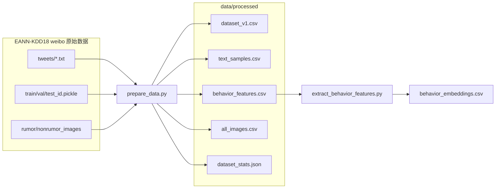

# Day2 A 给 B：`data/processed/` 数据格式交接说明

适用角色：成员 B（图像与多模态融合）  
撰写人：成员 A  
日期：2026-06-09  
范围：仅说明 `data/processed/` 目录下的表与 JSON；`outputs/` 中的向量与 Day3 预测见 [Day3-A文本与行为进度说明.md](Day3-A文本与行为进度说明.md)。

相关规格：[Day1-ABC开发组接口与任务规格.md](Day1-ABC开发组接口与任务规格.md)

---

## 0. 一句话总结

- **数据来源**：[EANN-KDD18](https://github.com/yaqingwang/EANN-KDD18) 公开的 **Weibo 多模态假新闻检测数据集**（KDD 2018 论文 *EANN: Event Adversarial Neural Networks for Multi-Modal Fake News Detection*），经 `src/prepare_data.py` 从本地 `weibo/` 原始文件解析并清洗。完整名称、下载链接与目录约定见 **§0.1**。
- **样本量**：7723 条（已去掉空文本）；主键为 **`sample_id`**（微博 `tweet_id`，字符串）。
- **B 最该先看**：[`data/processed/dataset_v1.csv`](../data/processed/dataset_v1.csv) —— 含 `image_path`、`label`、`split`，与 Day1 最小字段集一致。
- **多图场景**：查 [`data/processed/all_images.csv`](../data/processed/all_images.csv)。
- **汇总数字**：见 [`data/processed/dataset_stats.json`](../data/processed/dataset_stats.json)。

### 0.1 原始数据集（全名与获取方式）

| 项目 | 内容 |
| --- | --- |
| 数据集名称 | EANN-KDD18 Weibo 多模态假新闻 / 谣言检测数据集 |
| 论文 | Wang et al., *EANN: Event Adversarial Neural Networks for Multi-Modal Fake News Detection*, KDD 2018 |
| 官方 GitHub | [https://github.com/yaqingwang/EANN-KDD18](https://github.com/yaqingwang/EANN-KDD18) |
| 完整数据下载 | [Google Drive（约 1.3GB）](https://drive.google.com/file/d/14VQ7EWPiFeGzxp3XC2DeEHi-BEisDINn/view?usp=sharing)（链接见上述仓库 README → *Dataset*） |
| 仓库内示例子集 | 官方仓库 `data/` 目录为 quick start 子集；本组实验使用解压后的完整 Weibo 包 |

**本组本地 `weibo/` 目录结构**（与官方包一致，`prepare_data.py --weibo-root weibo`）：

| 路径 | 说明 |
| --- | --- |
| `weibo/tweets/train_rumor.txt`、`train_nonrumor.txt`、`test_rumor.txt`、`test_nonrumor.txt` | 文本与元数据（每 3 行一条：meta \| image_urls \| text） |
| `weibo/train_id.pickle`、`validate_id.pickle`、`test_id.pickle` | 官方 train / val / test 划分（`validate_id` → 本组 `val`） |
| `weibo/rumor_images/`、`weibo/nonrumor_images/` | 谣言 / 非谣言配图本地文件 |

**标签映射**（`prepare_data.py` 与官方 rumor/nonrumor 一致）：

| 官方 | 本组 `label` |
| --- | --- |
| rumor（谣言） | `risk` |
| nonrumor（非谣言） | `normal` |

**引用**（论文或报告中注明数据来源时可使用）：

```bibtex
@inproceedings{wang2018eann,
  title={EANN: Event Adversarial Neural Networks for Multi-Modal Fake News Detection},
  author={Wang, Yaqing and Ma, Fenglong and Jin, Zhiwei and Yuan, Ye and Xun, Guangxu and Jha, Kishlay and Su, Lu and Gao, Jing},
  booktitle={Proceedings of the 24th ACM SIGKDD International Conference on Knowledge Discovery \& Data Mining},
  pages={849--857},
  year={2018},
  organization={ACM}
}
```

---

## 1. 清洗后文件总览

| 文件 | 行数（约） | 含义 | 谁用 |
| --- | --- | --- | --- |
| `dataset_v1.csv` | 7723 | 主样本表：一条微博 = 一行。含清洗后 `text`、首张本地图 `image_path`、`label`、`split` 等 | **B 必读**；C 评估对齐也靠 `sample_id` |
| `all_images.csv` | 12713 | 多图展开表：同一 `sample_id` 可有多行，每行一张图（`image_index` 0,1,2…） | B 做多图实验时用；主表只保留 index=0 |
| `text_samples.csv` | 7723 | 纯文本表：`sample_id` + `text` + `label` + `split`（与主表同批样本） | A 跑 TF-IDF / BERT；B 融合不读，用 A 的 `text_embeddings.csv` |
| `behavior_features.csv` | 7723 | 行为原始特征（未标准化）：转发/评论/点赞、粉丝、文本长度、URL 数等 | A 行为分析；B 融合不读，用 A 的 `behavior_embeddings.csv` |
| `dataset_stats.json` | — | 全库统计：样本数、标签/划分分布、有图无图数量、各文件路径 | 快速自检 |

**生成上述 processed 文件**（需先按 §0.1 准备 [EANN-KDD18](https://github.com/yaqingwang/EANN-KDD18) Weibo 数据至 `weibo/`）：

```bash
uv run python src/prepare_data.py --weibo-root weibo --output-dir data/processed --handoff-dir outputs/handoff
```

**A 产出给 B 融合的两份向量 CSV**（依赖上一步；详见 [Day3-A文本与行为进度说明.md](Day3-A文本与行为进度说明.md)）：

```bash
uv run python src/extract_text_features.py
uv run python src/extract_behavior_features.py
```



说明：`prepare_data.py` 同时会写 `outputs/handoff/images_manifest.csv`（等于 `dataset_v1` 的 `sample_id,image_path,label,split` 四列），内容与主表图片列一致，本文不单独展开。

---

## 2. 全局约定

| 项目 | 约定 |
| --- | --- |
| 主键 | `sample_id`，字符串，全表唯一，与 C 评估、A/B 预测 CSV 对齐 |
| 标签 `label` | 二分类：`normal`（非谣言/正常） / `risk`（谣言/风险） |
| 划分 `split` | `train` / `val` / `test`（来自 `weibo/*.pickle`） |
| 路径 | 均为**仓库根目录相对路径**；读图时 `Path(repo_root) / image_path` |
| 编码 | UTF-8 CSV，首行为表头 |
| 缺失图片 | Day1 约定：保留样本，`image_path` 为空；图像向量填零并记录 |

当前规模（`dataset_stats.json` 快照）：

| 指标 | 数值 |
| --- | --- |
| 导出样本数 | 7723 |
| 有本地图 | 7681 |
| 无本地图 | 42 |
| `normal` | 3615 |
| `risk` | 4108 |
| `train` / `val` / `test` | 5415 / 843 / 1465 |

---

## 3. 逐文件说明

### 3.1 `dataset_v1.csv`（B 主入口）

**用途**：全组对齐用的主样本表，满足 Day1 §3.1 最小字段集。B 做图像预处理、ResNet 特征提取、与 C 对齐评估时，**以本表为样本清单**。

**粒度**：1 行 = 1 个 `sample_id`（已过滤清洗后文本为空的记录）。

**字段**：

| 字段 | 类型 | 可空 | 说明 |
| --- | --- | --- | --- |
| `sample_id` | string | 否 | 微博 ID，全表唯一 |
| `text` | string | 否 | 清洗后正文（去除 URL、手机号、邮箱、`@用户` 等，见 `prepare_data.clean_text`） |
| `image_path` | string | 是 | **首张**本地匹配图片的相对路径；无图则为空字符串 `""` |
| `label` | string | 否 | `normal` 或 `risk` |
| `source` | string | 否 | 固定为 `weibo_rumor_dataset`（对应 [EANN-KDD18](https://github.com/yaqingwang/EANN-KDD18) Weibo 数据，见 §0.1） |
| `split` | string | 否 | `train` / `val` / `test` |

**示例行**（节选）：

```csv
sample_id,text,image_path,label,source,split
3900416838856950,柯迪指挥官报告，我们已登上长城,weibo/nonrumor_images/62b31d36gw1ex8ts40449j20si0iygns.jpg,normal,weibo_rumor_dataset,train
```

B 实际读取图像时通常只需：`sample_id`, `image_path`, `label`, `split`。

---

### 3.2 `all_images.csv`（多图展开表）

**用途**：一条微博原文可能对应多张图片 URL；本表列出**所有能在本地 `weibo/*_images/` 匹配到的图片**，供 B 做多图实验或抽查。

**粒度**：1 行 = 一个 `(sample_id, image_index)` 组合。

**字段**：

| 字段 | 类型 | 说明 |
| --- | --- | --- |
| `sample_id` | string | 与主表一致 |
| `image_path` | string | 相对路径；无本地图时为空 |
| `image_index` | int | 从 0 起编号；**无本地图时为 -1**（仍保留一行占位） |
| `label` | string | 与主表一致 |
| `split` | string | 与主表一致 |

**与 `dataset_v1` 的关系**：

- 若某 `sample_id` 有图：`dataset_v1.image_path` = 本表中该 `sample_id` 且 `image_index=0` 的 `image_path`。
- 若某 `sample_id` 无图：主表 `image_path` 为空；本表有一行 `image_index=-1`、`image_path` 为空。

**示例**（同一样本多图）：

```csv
sample_id,image_path,image_index,label,split
3900416838856950,weibo/nonrumor_images/62b31d36gw1ex8ts40449j20si0iygns.jpg,0,normal,train
3900416838856950,weibo/nonrumor_images/62b31d36gw1ex8tsickrwj20tf0ivdhc.jpg,1,normal,train
```

---

### 3.3 `text_samples.csv`（A 文本分支输入）

**用途**：仅保留文本与标签、划分，供 A 做 TF-IDF / BERT 等文本模型。行集合与 `dataset_v1` 一致（同一批 `sample_id`）。

**粒度**：1 行 = 1 个 `sample_id`。

**字段**：

| 字段 | 说明 |
| --- | --- |
| `sample_id` | 主键 |
| `text` | 与 `dataset_v1.text` 相同 |
| `label` | `normal` / `risk` |
| `split` | `train` / `val` / `test` |

B 做融合时一般**不必**读本表；文本向量由 A 产出在 `outputs/predictions/text_embeddings.csv`（另见 A 后续交接）。

---

### 3.4 `behavior_features.csv`（行为基线特征，未标准化）

**用途**：从微博元数据行与文本统计抽取的数值特征，供 A 行为分析与扩展。数值为**原始尺度**，未做 StandardScaler。

**粒度**：1 行 = 1 个 `sample_id`。

**字段**：

| 字段 | 含义 |
| --- | --- |
| `sample_id`, `label`, `split` | 对齐主表 |
| `verified` | 是否认证用户（0/1） |
| `reposts` | 转发数 |
| `comments` | 评论数 |
| `likes` | 点赞数 |
| `engagement_total` | 转发 + 评论 + 点赞 |
| `interaction_ratio` | `likes / max(reposts + comments, 1)` |
| `followers` | 粉丝数（见 §5：nonrumor 常为 0） |
| `following` | 关注数 |
| `posts_count` | 发微博数 |
| `num_image_urls` | 原文中图片 URL 个数 |
| `text_length` | 清洗后文本字符长度 |
| `url_mentions` | 文本中 URL 出现次数 |
| `at_mentions` | 文本中 `@用户` 出现次数 |

**示例行**（节选）：

```csv
sample_id,label,split,verified,reposts,comments,likes,engagement_total,interaction_ratio,followers,following,posts_count,num_image_urls,text_length,url_mentions,at_mentions
3900416838856950,normal,train,1,28,18,30,76,0.652174,0,0,0,9,15,0,0
```

---

### 3.5 `dataset_stats.json`（机器可读汇总）

**用途**：快速查看导出规模、标签与划分分布、各产物路径；写报告或自检时用。

**主要字段**：

| 字段 | 说明 |
| --- | --- |
| `parsed_records` | 从原始推文解析到的记录数 |
| `exported_rows` | 最终写入 `dataset_v1` 的行数 |
| `empty_text_dropped` | 因空文本丢弃的数量 |
| `with_local_image` / `without_local_image` | 有/无本地图样本数 |
| `label_counts` | 各标签计数 |
| `split_counts` | 各划分计数 |
| `outputs` | 各 CSV 相对路径映射 |

---

## 4. B 侧最小使用方式（仅 `data/processed`）

1. **样本列表与划分**：读 `dataset_v1.csv`，按 `split` 过滤 train/val/test。
2. **单图路径**：使用 `image_path`；加载前检查 `os.path.exists(repo_root / image_path)`。
3. **多图**：对给定 `sample_id` 在 `all_images.csv` 中筛选，`image_index >= 0`，按 `image_index` 排序。
4. **无图样本**（当前 42 条）：`image_path == ""` 或 `all_images.image_index == -1`；按 Day1 用**零向量**占位，并在日志中记录 `sample_id`。
5. **标签**：训练/评估用 `label`；交给 C 的预测 CSV 须用 Day1 统一格式（`true_label` / `pred_label` 等），但 `sample_id` 必须与本表一致。

推荐 B 首日自检命令（与 [Day2-B图像预处理进度说明.md](Day2-B图像预处理进度说明.md) 一致）：

```bash
python3 src/extract_image_features.py --input data/processed/dataset_v1.csv --limit 20
```

---

## 5. 已知数据限制（必读）

1. **nonrumor 用户画像字段常为 0**  
   原始 `train_nonrumor.txt` / `test_nonrumor.txt` 的元数据列格式与 rumor 文件不同，`followers` / `following` / `posts_count` 在 nonrumor 样本上常被填为 0。行为特征仍可用于 rumor 子集或相对统计，但不宜单独解读 nonrumor 的粉丝数。

2. **42 条样本无本地图片**  
   原文可能有图 URL，但 `weibo/rumor_images` 或 `weibo/nonrumor_images` 中未匹配到文件。B 应对这些样本填零向量，不要从表中删除。

3. **文本已脱敏清洗**  
   手机号、邮箱、URL、`@用户` 等已在 `text` 中替换或删除，与原始推文不完全一致。

4. **Git 不提交真实数据**  
   `data/processed/` 在 `.gitignore` 中；B 需从 A 或共享盘获取本地 CSV，不能仅依赖 `git clone`。

---

## 6. 如何重新生成

见 §1「清洗后文件总览」中的命令。完整 A 侧流水线（含 TF-IDF 基线）见 [Day3-A文本与行为进度说明.md](Day3-A文本与行为进度说明.md)。

---

## 7. 变更记录

| 日期 | 版本 | 变更人 | 说明 |
| --- | --- | --- | --- |
| 2026-06-09 | v1.2 | 成员 A | 新增 §0.1：写明 EANN-KDD18 数据集全名、GitHub / Google Drive 链接、本地 `weibo/` 约定及 BibTeX |
| 2026-06-09 | v1.1 | 成员 A | 删除 `behavior_features_enriched.csv`；补充 processed 文件含义表与向量生成命令 |
| 2026-06-08 | v1.0 | 成员 A | 首版：覆盖 `data/processed/` 产物，供 B Day2 图像预处理与后续 ResNet 使用 |
