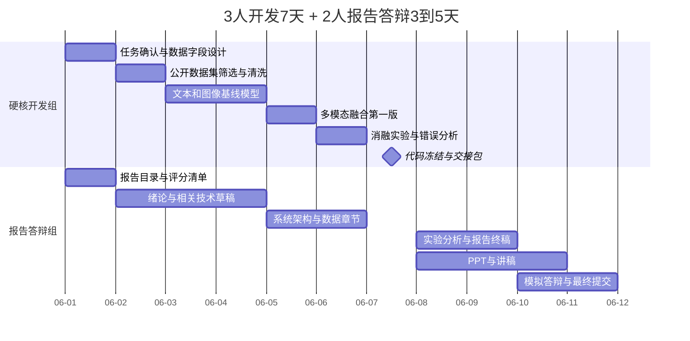

# 人员分工参考

适用项目：基于多模态社交网络的内容风控与异常检测

本文按“3 人硬核开发组（7 天全力冲刺）+ 2 人报告答辩组（后 3-5 天高强度输出）”设计。成员 A-E 为占位符，正式提交前替换为真实姓名即可。

这里的分工重点不是让每个人做同一种工作，而是让每个人都有明确的交付物、截止时间和验收标准。开发组负责把实验跑通，报告答辩组负责把成果讲清楚、写规范、做成能提交和答辩的材料。

## 1. 分组原则

| 原则                    | 说明                                                                                            |
| ----------------------- | ----------------------------------------------------------------------------------------------- |
| 开发组先交付可复现实验  | 开发组必须在第 7 天交出数据说明、模型说明、实验指标、图表和复现命令，避免报告组后期无材料可写。 |
| 报告组从第 1 天开始工作 | 报告组不能等开发结束才开始，应提前完成绪论、相关技术、报告模板、PPT 结构和评分清单。            |
| 交接材料要可直接引用    | 开发组给出的图表、指标和解释文字应能直接进入报告或 PPT，不能只丢代码。                          |
| 后期模型不再大改        | 第 7 天后原则上只修复阻塞问题，不再重构模型，避免报告和 PPT 反复返工。                          |

## 2. 角色分工矩阵

| 成员   | 所属小组   | 主要职责                                                                                                                                               | 主要交付物                                           |
| ------ | ---------- | ------------------------------------------------------------------------------------------------------------------------------------------------------ | ---------------------------------------------------- |
| 成员 A | 硬核开发组 | 数据负责人兼文本模型负责人。负责公开数据集筛选、字段规范、数据清洗、脱敏、训练/验证/测试划分；实现 TF-IDF 基线模型和 BERT/中文 RoBERTa 文本分支。      | 数据说明卡、清洗流程说明、文本模型指标、文本特征图表 |
| 成员 B | 硬核开发组 | 图像模型与多模态融合负责人。负责图片读取、尺寸归一化、ResNet18/ResNet50 特征提取；必要时加入 OCR 文字识别；实现文本、图像、行为特征拼接和 MLP 分类器。 | 图像模型指标、融合模型指标、模型结构图、消融实验结果 |
| 成员 C | 硬核开发组 | 系统集成与评测负责人。负责把 A 和 B 的模块接成统一流程，管理运行命令、随机种子、指标计算、混淆矩阵、ROC/PR 曲线、实验表格和最终结果归档。              | 可复现实验命令、指标表、评估图、代码冻结交接包       |
| 成员 D | 报告答辩组 | 报告总编。第 1 天开始搭建报告大纲，负责绪论、相关工作、系统设计、实验分析、总结展望、格式统一、图表编号和最终查错。                                    | 完整报告、图表编号、参考文献、成员分工说明           |
| 成员 E | 报告答辩组 | PPT 与答辩负责人。第 1 天开始准备答辩结构，负责 PPT 页面设计、讲稿、演示路线、问答准备和最终上台汇报。                                                 | 答辩 PPT、讲稿、问答表、演示检查清单                 |

## 3. 7 天开发 + 后 3-5 天输出流程

| 天数            | 开发组任务                                                                                    | 报告答辩组任务                                                                       | 当天必须交付                              |
| --------------- | --------------------------------------------------------------------------------------------- | ------------------------------------------------------------------------------------ | ----------------------------------------- |
| 第 1 天         | 明确标签定义、样本字段、数据来源优先级；A 建立数据字段表；B/C 确认模型输入输出格式。          | D 建立报告目录；E 建立 PPT 目录；收集课程评分标准、字数、页数、答辩时长要求。        | 项目任务书、数据字段表、报告/PPT 初版目录 |
| 第 2 天         | A 完成公开数据集筛选和最小可用样本；完成脱敏规则；C 建立实验记录表。                          | D 完成绪论背景草稿；E 准备问题定义和痛点页面。                                       | 数据来源清单、样本预览、绪论草稿          |
| 第 3 天         | A 跑通 TF-IDF + 逻辑回归文本基线；B 跑通 ResNet 图像特征提取；C 建立评估函数。                | D 写相关技术：自然语言处理、计算机视觉、多模态融合、用户行为特征；E 画系统总览草图。 | 文本基线指标、图像特征维度、评估脚本说明  |
| 第 4 天         | A 开始 BERT/中文 RoBERTa 微调或特征提取；B 完成图像分类基线；C 统一训练日志格式。             | D 写数据集与预处理章节；E 做数据样例页、流程页。                                     | 文本/图像基线对比、数据预处理章节         |
| 第 5 天         | B 完成多模态拼接 + MLP；A 补充用户行为特征；C 跑第一版融合实验。                              | D 写系统架构章节；E 确认模型结构图是否和代码一致。                                   | 第一版融合模型结果、系统架构图            |
| 第 6 天         | 开发组做消融实验：仅文本、仅图像、仅行为、文本+图像、全部特征；修复数据泄漏和类别不均衡问题。 | D 准备实验结果章节模板；E 准备结果可视化页面模板。                                   | 消融实验表、错误案例样例、风险记录        |
| 第 7 天         | 代码冻结。C 导出最终指标、图表、命令、模型说明；A/B 各写 300-500 字技术解释。                 | D/E 接收交接包并核对缺失项；形成报告/PPT 待补问题清单。                              | 代码冻结交接包、最终图表、技术解释        |
| 第 8 天         | 开发组只处理阻塞问题，不再大改模型；回答 D/E 的技术问题。                                     | D 完成实验结果与分析初稿；E 完成 PPT 60% 页面。                                      | 报告实验章节初稿、PPT 初稿                |
| 第 9 天         | 开发组复核报告中的技术描述和图表含义。                                                        | D 完成报告完整初稿；E 完成 PPT 完整初稿和讲稿初稿。                                  | 报告第一版、PPT 第一版、讲稿第一版        |
| 第 10 天        | 开发组准备老师可能追问的技术答复。                                                            | D 完成排版、引用、查错；E 完成试讲和问答表。                                         | 报告终稿、PPT 终稿、问答表                |
| 第 11-12 天可选 | 只做错误修正和复现实验确认。                                                                  | 多轮模拟答辩，压缩超时内容，准备备用解释页。                                         | 最终提交包、演示备份、答辩排练记录        |

## 4. 甘特图

下面的日期仅用于甘特图渲染，可按实际项目开始日期整体平移。

## 5. 第 7 天交接包

开发组必须在第 7 天交给报告答辩组以下材料：

| 材料     | 要求                                                               |
| -------- | ------------------------------------------------------------------ |
| 数据说明 | 数据来源、样本量、标签定义、字段说明、脱敏规则、训练/验证/测试比例 |
| 模型说明 | 使用的基础模型、输入输出、融合方式、训练参数、硬件和运行时长       |
| 结果表   | 准确率、精确率、召回率、F1 值，至少包含基线模型和融合模型对比      |
| 图表     | 混淆矩阵、ROC 或 PR 曲线、训练损失曲线、消融实验柱状图             |
| 错误案例 | 3-5 个误判样例，说明模型失败原因，方便写局限性                     |
| 复现命令 | 从数据处理到评估的命令顺序，避免报告组无法解释结果                 |
| 技术解释 | A/B/C 每人 300-500 字，说明自己模块怎么做、为什么这样做            |

## 6. 答辩问题准备

| 可能问题                             | 建议回答方向                                                                                 |
| ------------------------------------ | -------------------------------------------------------------------------------------------- |
| 为什么选择多模态，而不是只用文本？   | 有害内容常通过谐音字、截图、图片变体绕过文本过滤，多模态能同时利用文本、图像和行为信息。     |
| 为什么基础模型选 BERT 和 ResNet？    | 两者成熟、资料多、可复现性强，适合 7 天冲刺；先保证基线模型，再考虑复杂模型。                |
| 公开数据集和真实平台数据有什么差距？ | 公开数据集便于合规复现，但存在分布差异；报告中把它作为局限性，并提出后续可接入合规平台数据。 |
| 融合方式为什么先用拼接 + MLP？       | 拼接方案实现稳定、可解释、适合短周期项目；注意力融合作为效果不足时的扩展。                   |
| 如何避免 public 仓库泄露隐私？       | 不提交原始数据、密钥、账号、模型权重；只提交代码、说明、脱敏样例和可复现实验配置。           |

## 7. 验收标准

| 验收项         | 标准                                                    |
| -------------- | ------------------------------------------------------- |
| 开发可复现     | 第 7 天能用同一套命令跑出最终测试指标。                 |
| 图表可追溯     | 报告中每张图都能追溯到具体实验或数据处理步骤。          |
| 答辩讲得清     | PPT 能在规定时间内讲清楚问题、方法、实验和结论。        |
| 仓库无隐私风险 | public 仓库不包含隐私、密钥、真实账号或大体积模型文件。 |
