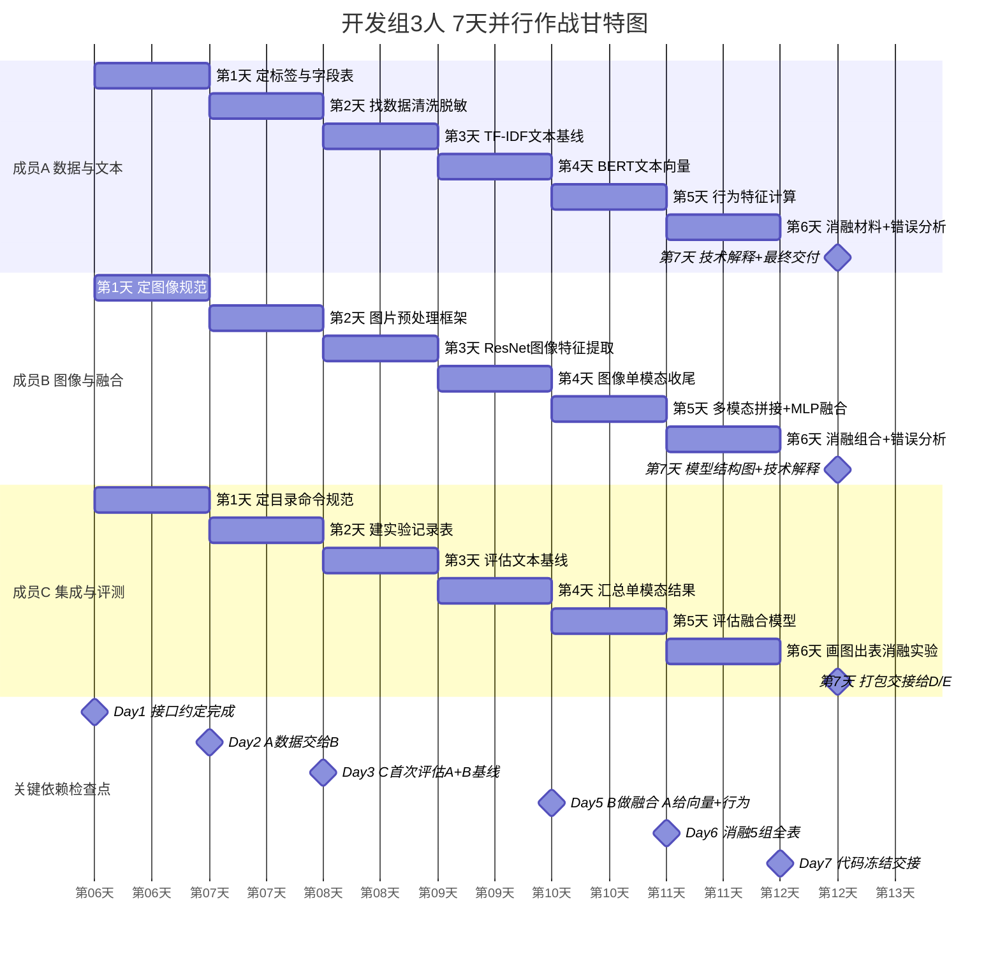
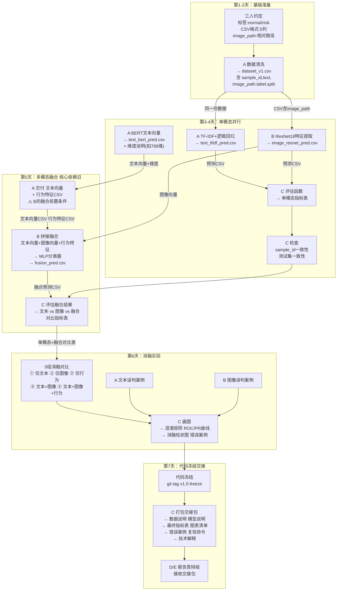
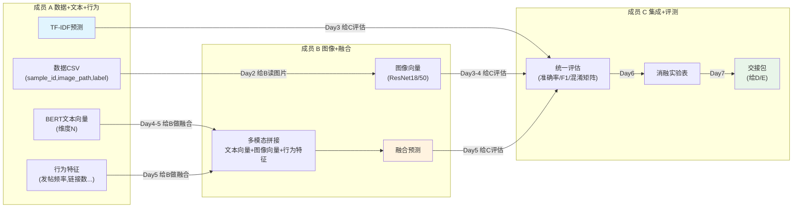
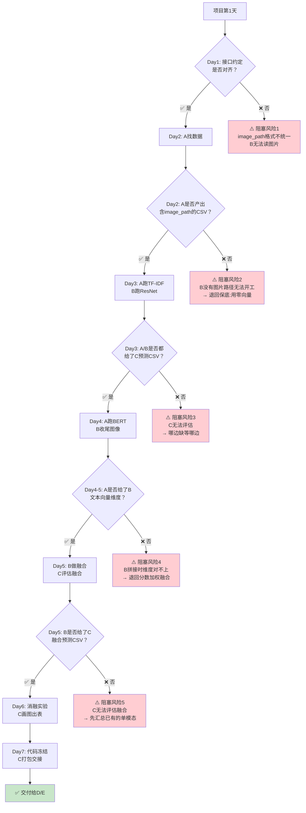

# 开发组协作流程（甘特图 + 数据流图）

> 在 VS Code 中预览纯 Mermaid 甘特图请打开 `开发组协作流程.mmd`。
> 本文包含全部 4 幅图及说明文字。

---

## 图一：7天并行甘特图（时间视角）

---

## 图二：模块数据流图（数据视角，显示谁产出什么文件、交给谁）

---

## 图三：模块接口依赖链（简化版，适合放 PPT）

---

## 图四：阻塞风险链条（风险视角，帮助排雷）

