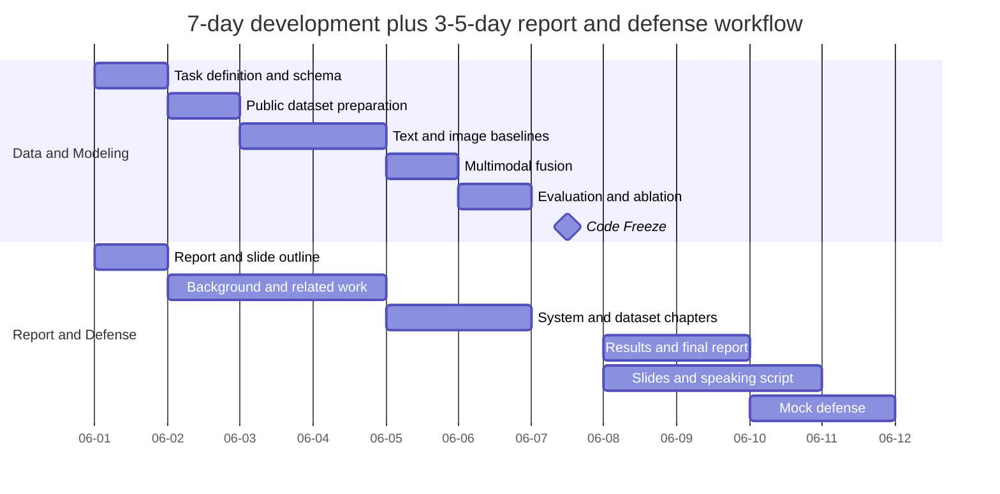

# 项目入手指南

项目方向：基于多模态社交网络的内容风控与异常检测  
核心目标：结合文本内容、图像/OCR 信息和用户行为特征，识别垃圾广告、诈骗信息、异常账号或其他有害内容。

本文默认采用“公开数据集优先，爬虫补充”的路线。这样更适合课程项目、公开 GitHub 仓库和 7 天开发冲刺。

## 1. 快速开始

首次拉取仓库后，在项目根目录执行：

```powershell
uv sync
uv run python -c "import torch, transformers, pandas, sklearn; print('env ok')"
```

本项目的 Python 版本固定为 3.11，依赖由 `uv` 管理。不要把 `.venv/`、真实数据集、模型权重或 `.env` 提交到 public 仓库。

## 2. 推荐目录规划

当前先以文档和环境初始化为主。进入开发阶段时建议按下面方式扩展：

```text
.
├── document/                 # 课题说明、分工、入手指南、报告素材
├── data/                     # 本地数据，已被 .gitignore 排除
│   ├── raw/                  # 原始公开数据或爬虫原始输出
│   ├── interim/              # 清洗中间结果
│   └── processed/            # 训练可用数据
├── models/                   # 本地模型权重，已被 .gitignore 排除
├── outputs/                  # 指标、图表、预测结果，已被 .gitignore 排除
├── src/                      # 后续代码目录
└── README.md
```

## 3. 总体流程

| 阶段            | 时间      | 目标                                       | 关键产出                                        |
| --------------- | --------- | ------------------------------------------ | ----------------------------------------------- |
| 准备与数据      | Day 1-2   | 明确任务、找公开数据集、定义字段、清洗脱敏 | 数据字段表、样本预览、train/val/test 划分       |
| 单模态 baseline | Day 3-4   | 跑通文本、图像、行为特征的独立模型         | TF-IDF baseline、BERT 文本结果、ResNet 图像结果 |
| 多模态融合      | Day 5     | 拼接文本、图像、行为特征并训练 MLP 分类器  | 第一版融合模型指标                              |
| 评估与冻结      | Day 6-7   | 做消融实验、错误分析、导出图表和复现命令   | Code Freeze 交接包                              |
| 报告与 PPT      | Day 8-10  | 完成报告、PPT、讲稿和 Q&A                  | 报告终稿、PPT 终稿、答辩稿                      |
| 可选缓冲        | Day 11-12 | 模拟答辩、修错、补备用页                   | 最终提交包                                      |

## 4. 如何找语料和数据

优先顺序如下：

1. 公开数据集平台：Hugging Face Datasets、Kaggle、公开论文附录、GitHub 开源数据仓库。
2. 课程允许的数据：老师提供的样例、公开竞赛数据、课堂推荐方向中的网络信息采集样本。
3. 爬虫补充：只采集公开页面，不登录、不绕过反爬、不保存 cookie、不采集私信或个人敏感信息。

搜索关键词可以组合使用：

```text
spam detection dataset
social media spam dataset
fraud detection text image dataset
harmful content detection dataset
multimodal misinformation dataset
Chinese spam text dataset
short video comment spam dataset
```

最低可用数据字段建议如下：

| 字段                | 说明                                               |
| ------------------- | -------------------------------------------------- |
| `sample_id`         | 样本唯一编号                                       |
| `text`              | 文本内容，如标题、评论、简介、帖子正文             |
| `image_path`        | 图片本地路径，没有图片时为空                       |
| `behavior_features` | 用户行为特征 JSON，如发帖频率、互动比、粉丝/关注比 |
| `label`             | 分类标签，如 `normal`、`spam`、`fraud`、`harmful`  |
| `source`            | 数据来源说明，只写公开来源，不写个人隐私           |
| `split`             | `train`、`val` 或 `test`                           |

爬虫只作为补充时，建议采集公开列表页、公开帖子标题、公开评论片段和公开图片 URL。保存前要脱敏：去掉用户名、主页链接、手机号、邮箱、二维码、精确地理位置和任何可识别个人身份的信息。

## 5. 如何选基础模型

先跑稳定 baseline，再做深度模型。7 天项目中，能复现、能解释、能出图，比盲目追求复杂模型更重要。

| 模块       | 保底方案                                        | 主线方案                                         | 扩展方案                                 |
| ---------- | ----------------------------------------------- | ------------------------------------------------ | ---------------------------------------- |
| 文本       | TF-IDF + Logistic Regression                    | `bert-base-chinese` 或中文 RoBERTa 特征提取/微调 | 情感倾向、关键词命中、提示词规避样例分析 |
| 图像       | ResNet18 特征提取                               | ResNet50 微调或冻结特征 + 分类器                 | OCR 提取图片文字后并入文本分支           |
| 用户行为   | 手工统计特征 + RandomForest/Logistic Regression | 行为特征标准化后并入融合模型                     | 异常频率、重复内容比例、互动异常检测     |
| 多模态融合 | 文本分数、图像分数、行为分数加权平均            | 特征拼接 + MLP 分类器                            | Attention 融合或 late fusion 对比        |

推荐默认路线：

1. Day 3 先完成 TF-IDF + Logistic Regression，得到最小可解释文本 baseline。
2. Day 4 使用 `bert-base-chinese` 或中文 RoBERTa。数据少时先冻结模型做特征提取，数据较多或有 GPU 时再微调。
3. Day 4 使用 ResNet18 或 ResNet50。先用预训练模型提取图片向量，再接分类器。
4. Day 5 把文本向量、图像向量、行为特征拼接，训练一个 MLP 分类器。
5. Day 6 做消融实验，证明多模态比单一模态更有价值。

## 6. 训练与推理流程

### 6.1 数据处理

1. 去重：按文本哈希、图片哈希或 `sample_id` 去重。
2. 脱敏：去掉账号、手机号、邮箱、链接 token、二维码和精确位置。
3. 清洗：统一空值、超长文本截断、异常图片过滤。
4. 划分：推荐 `train:val:test = 7:1:2` 或 `8:1:1`。
5. 类别均衡：如果垃圾/诈骗样本很少，记录类别比例，并在训练时使用 class weight 或采样策略。

### 6.2 文本模型

保底 baseline：

```text
文本清洗 -> TF-IDF -> Logistic Regression -> 输出概率和预测标签
```

深度模型：

```text
文本 -> tokenizer -> BERT/中文 RoBERTa -> [CLS] 向量 -> 分类层 -> 输出概率
```

数据量较小的时候，优先冻结 BERT 主体，只训练分类层，速度更快，也更容易在普通电脑上跑通。

### 6.3 图像模型

主线流程：

```text
图片读取 -> resize/normalize -> ResNet18/ResNet50 -> 图像向量 -> 分类层或融合层
```

如果图片中包含大量文字、截图、广告海报，可以增加 OCR。OCR 结果不要直接当最终结论，而是作为额外文本输入进入文本分支。

### 6.4 用户行为特征

建议从简单统计开始：

| 特征                       | 说明                           |
| -------------------------- | ------------------------------ |
| `post_frequency`           | 单位时间发帖数量               |
| `duplicate_ratio`          | 重复文本或相似图片比例         |
| `follower_following_ratio` | 粉丝数与关注数比例             |
| `interaction_ratio`        | 点赞、评论、转发与粉丝数的比例 |
| `url_count`                | 文本中链接数量                 |
| `sensitive_keyword_count`  | 命中诈骗、广告、导流词的数量   |

这些特征先标准化，再和文本、图像向量拼接。

### 6.5 多模态融合

默认采用 early fusion：

```text
text_embedding + image_embedding + behavior_vector
        -> concatenate
        -> MLP classifier
        -> spam/fraud/harmful probability
```

如果时间不足，使用 late fusion：

```text
文本模型概率 * 0.5 + 图像模型概率 * 0.3 + 行为模型概率 * 0.2
```

如果时间充足，再尝试 Attention 融合，并把它作为扩展实验，不要让它阻塞主线交付。

## 7. 评估与图表

必须输出：

| 图表或指标       | 用途                                       |
| ---------------- | ------------------------------------------ |
| Accuracy         | 总体正确率，容易理解但不能单独使用         |
| Precision        | 被判为有害内容时有多少是真的               |
| Recall           | 实际有害内容中有多少被找出来               |
| F1-score         | Precision 和 Recall 的折中，适合类别不均衡 |
| Confusion Matrix | 展示误判和漏判                             |
| ROC 或 PR Curve  | 展示不同阈值下的性能                       |
| Ablation Table   | 证明文本、图像、行为、多模态融合各自贡献   |
| Error Cases      | 展示模型局限性，方便答辩解释               |

推荐消融实验表：

| 实验                    | 输入特征   | 目的                   |
| ----------------------- | ---------- | ---------------------- |
| Text only               | 文本       | 验证文本模型基础能力   |
| Image only              | 图片       | 验证图片是否含有效信号 |
| Behavior only           | 用户行为   | 验证异常账号特征       |
| Text + Image            | 文本和图片 | 验证双模态融合         |
| Text + Image + Behavior | 全部特征   | 最终方案               |

## 8. 7 天开发流程细表

| Day   | 负责人 | 任务                                       | 验收标准                        |
| ----- | ------ | ------------------------------------------ | ------------------------------- |
| Day 1 | A/B/C  | 确认任务定义、标签体系、数据字段、目录结构 | 有一份数据字段表和实验任务清单  |
| Day 2 | A      | 找公开数据集，完成最小样本清洗和脱敏       | 至少有一个可训练 CSV/JSONL 样例 |
| Day 3 | A/B/C  | 文本 baseline、图像特征提取、评估函数      | 能跑出第一组 baseline 指标      |
| Day 4 | A/B    | BERT 文本分支、ResNet 图像分支             | 文本和图像模型都能独立预测      |
| Day 5 | B/C    | 多模态特征拼接和 MLP 融合                  | 能跑出融合模型结果              |
| Day 6 | A/B/C  | 消融实验、错误案例、指标图表               | 有最终表格和 3-5 个错误案例     |
| Day 7 | C 主导 | Code Freeze，整理交接包                    | 报告组能直接引用图表和解释      |

## 9. 后 3-5 天报告与答辩流程

| Day            | 负责人 | 任务                                             | 验收标准                       |
| -------------- | ------ | ------------------------------------------------ | ------------------------------ |
| Day 8          | D/E    | 接收 Code Freeze 包，完成实验分析初稿和 PPT 初稿 | 报告实验章节成型，PPT 完成 60% |
| Day 9          | D/E    | 完成报告 v1、PPT v1、讲稿 v1                     | 开发组复核技术描述无明显错误   |
| Day 10         | D/E    | 完成终稿、排版、图表编号、Q&A 表和试讲           | 可正式提交和答辩               |
| Day 11-12 可选 | 全员   | 模拟答辩、修正超时内容、准备备用页               | 讲稿不卡顿，关键问题有标准回答 |

## 10. Mermaid 甘特图



## 11. Public 仓库注意事项

不要提交：

- 真实平台账号、cookie、token、手机号、邮箱、身份证明信息。
- 未脱敏原始数据、爬虫原始 HTML、二维码、头像、主页链接。
- 大体积模型权重、训练 checkpoint、日志平台缓存。
- `.env`、本地绝对路径、老师或同学的私有资料。

可以提交：

- 代码、配置模板、脱敏样例、数据字段说明、实验方法说明。
- 小体积图表和最终报告素材。
- `.env.example` 这种不含真实密钥的占位文件。

## 12. 最终交付清单

| 类别     | 文件或材料                                 |
| -------- | ------------------------------------------ |
| 代码     | 数据处理、训练、推理、评估脚本             |
| 数据说明 | 数据来源、字段、标签、脱敏规则             |
| 实验结果 | 指标表、混淆矩阵、ROC/PR 曲线、消融表      |
| 报告     | 背景、方法、系统架构、实验、总结、分工     |
| PPT      | 研究问题、方法流程、实验结果、亮点、局限性 |
| 答辩     | 讲稿、Q&A、备用解释页                      |
