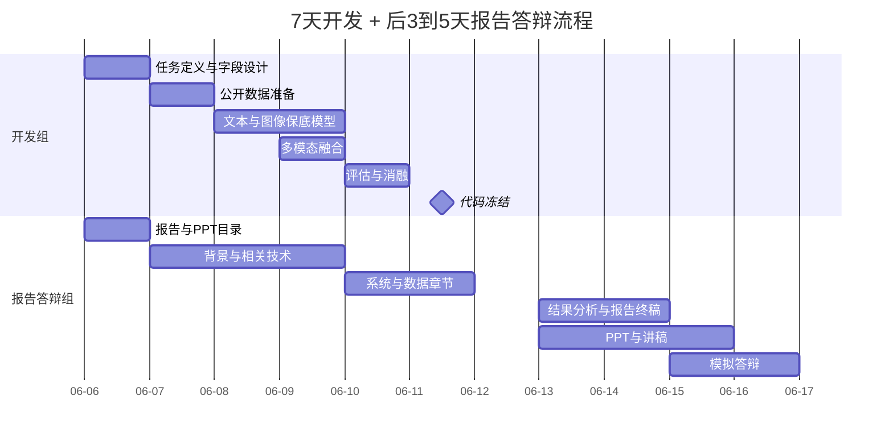

# 项目入手指南

项目方向：基于多模态社交网络的内容风控与异常检测  
项目定位：选修课探索性工程项目，优先保证能落地、能解释、能展示、能答辩  
核心目标：结合文本内容、图像/OCR 信息和用户行为特征，识别垃圾广告、诈骗信息、异常账号或其他有害内容。

本文是项目总入口，给三类读者使用：

- 组员：快速知道自己该做什么、怎么做、做不出来怎么保底。
- 老师或评分同学：快速理解这个项目解决什么问题、方法是否完整、交付是否合理。
- 大模型 Agent：复制本文的上下文后，可以更快辅助某个成员完成数据、模型、报告或答辩任务。

## 1. 5 分钟读懂项目

### 1.1 一句话说明

这个项目尝试用“文本 + 图片 + 用户行为”三类信息，判断社交平台上的内容或账号是否存在垃圾广告、诈骗、有害内容等风险。

### 1.2 为什么要做

传统内容检测如果只看文字，很容易被绕过。例如：

- 用谐音字、错别字、拆字来躲避关键词检测。
- 把广告、诈骗信息放进图片或截图里。
- 文本看起来正常，但账号行为很异常，例如频繁发帖、重复发相同内容、链接特别多。

所以本项目不只看文本，而是把文本、图片和用户行为放在一起综合判断。

### 1.3 怎么做

整体流程很简单：

```text
找公开数据
-> 清洗和脱敏
-> 做文本模型
-> 做图像模型或图像特征
-> 加入用户行为特征
-> 多模态融合
-> 评估指标和图表
-> 写报告和做 PPT
```

项目架构图见：[../Architecture.mmd](../Architecture.mmd)

### 1.4 做出什么结果

最终不要求做出论文级最优模型，要求交付一套完整探索流程：

| 结果 | 用途 |
| --- | --- |
| 数据说明 | 说明数据从哪里来、字段是什么、如何脱敏。 |
| 模型结果 | 说明文本、图像、行为、多模态融合分别表现如何。 |
| 指标图表 | 用准确率、精确率、召回率、F1 值、混淆矩阵等说明效果。 |
| 错误案例 | 说明模型为什么会误判，体现探索性分析。 |
| 报告 | 讲清背景、方法、实验、结论和局限性。 |
| PPT 和答辩 | 在规定时间内让老师理解项目价值和小组分工。 |

### 1.5 这个项目怎么才算成功

最低成功标准不是“模型指标特别高”，而是：

1. 数据来源和隐私处理说得清。
2. 至少有一个保底模型能跑通。
3. 至少有一组可解释的评估指标和图表。
4. 能说明多模态方案为什么有意义。
5. 结果不好时能分析原因，而不是只说失败。
6. 报告和 PPT 能完整复述整个工程流程。

## 2. 给大模型 Agent 的项目上下文

如果组员想把本文复制给 GPT 或其他大模型 Agent，让它继续辅助自己，请优先复制下面这一段。

```text
你正在辅助一个网络内容安全选修课项目。项目名称是“基于多模态社交网络的内容风控与异常检测”。

项目目标：
结合文本内容、图像/OCR 信息和用户行为特征，识别社交平台上的垃圾广告、诈骗、有害内容或异常账号。

项目定位：
这是选修课探索性工程项目，不是硬性研究论文项目。优先级是：流程完整 > 能复现 > 能解释 > 能答辩 > 指标好看。

推荐技术路线：
1. 数据：公开数据集优先，爬虫只作为补充，必须脱敏。
2. 文本：保底用 TF-IDF + 逻辑回归，标准方案用 bert-base-chinese 或中文 RoBERTa。
3. 图像：保底用预训练 ResNet18/ResNet50 提取特征，不强制微调。
4. 用户行为：发帖频率、链接数量、重复内容比例、粉丝关注比、互动比。
5. 融合：保底用分数加权，标准方案用文本向量 + 图像向量 + 行为特征拼接后接 MLP。
6. 评估：准确率、精确率、召回率、F1 值、混淆矩阵、ROC/PR 曲线、消融实验、错误案例。

成员分工：
成员 A：数据与文本模型。
成员 B：图像模型与多模态融合。
成员 C：系统集成与评测。
成员 D：报告撰写与排版。
成员 E：PPT、讲稿和答辩。

隐私约束：
这是 public GitHub 仓库。不要提交真实数据、账号、cookie、token、手机号、邮箱、二维码、原始爬虫 HTML、模型权重、.env 或本地绝对路径。

你辅助时要：
1. 用通俗语言解释，不要默认学生上过 NLP 或计算机视觉课程。
2. 每个建议都给保底方案、标准方案和拔高方案。
3. 如果模型效果不好，帮助分析原因并给可写进报告的说法。
4. 输出能直接复制进报告、PPT、代码注释或任务清单的内容。
```

## 3. 先读哪些文件

| 文件 | 适合谁读 | 用途 |
| --- | --- | --- |
| [../README.md](../README.md) | 所有人 | 了解仓库、环境、隐私规则。 |
| [../Architecture.mmd](../Architecture.mmd) | 所有人 | 快速看项目分工和工程主流程。 |
| [人员分工参考Team-Responsibility-Reference.md](人员分工参考Team-Responsibility-Reference.md) | 所有人 | 看 5 人分工、时间线和交接规则。 |
| [成员A数据与文本模型指南Member-A-Data-Text-Guide.md](成员A数据与文本模型指南Member-A-Data-Text-Guide.md) | 成员 A | 数据、文本模型、行为特征。 |
| [成员B图像与多模态融合指南Member-B-Image-Fusion-Guide.md](成员B图像与多模态融合指南Member-B-Image-Fusion-Guide.md) | 成员 B | 图像模型、OCR、多模态融合。 |
| [成员C系统集成与评测指南Member-C-Integration-Evaluation-Guide.md](成员C系统集成与评测指南Member-C-Integration-Evaluation-Guide.md) | 成员 C | 实验流程、指标、图表、交接包。 |
| [成员D报告撰写指南Member-D-Report-Writing-Guide.md](成员D报告撰写指南Member-D-Report-Writing-Guide.md) | 成员 D | 报告结构、写作、结果分析。 |
| [成员EPPT与答辩指南Member-E-Slides-Defense-Guide.md](成员EPPT与答辩指南Member-E-Slides-Defense-Guide.md) | 成员 E | PPT、讲稿、问答和模拟答辩。 |

## 4. 快速开始

首次拉取仓库后，在项目根目录执行：

```powershell
uv sync
uv run python -c "import torch, transformers, pandas, sklearn; print('env ok')"
```

如果输出 `env ok`，说明基础 Python 环境可用。  
如果环境安装失败，不要卡住整个项目，先继续做文档、数据字段表、报告框架和 PPT 框架。

本项目的 Python 版本固定为 3.11，依赖由 `uv` 管理。不要把 `.venv/`、真实数据集、模型权重或 `.env` 提交到 public 仓库。

## 5. 推荐目录规划

当前仓库先以文档和环境初始化为主。进入开发阶段时建议按下面方式扩展：

```text
.
├── Architecture.mmd          # 工程分工与主流程图
├── document/                 # 课题说明、分工、入手指南、个人指南、报告素材
├── data/                     # 本地数据，已被 .gitignore 排除
│   ├── raw/                  # 原始公开数据或爬虫原始输出
│   ├── interim/              # 清洗中间结果
│   └── processed/            # 训练可用数据
├── models/                   # 本地模型权重，已被 .gitignore 排除
├── outputs/                  # 指标、图表、预测结果，已被 .gitignore 排除
│   ├── metrics/
│   ├── figures/
│   └── predictions/
├── src/                      # 后续代码目录
└── README.md
```

`data/`、`models/`、`outputs/` 是本地工作目录，不要提交真实内容到 GitHub。

## 6. 保底路线 / 标准路线 / 拔高路线

| 路线 | 适合情况 | 做法 | 最终能交付什么 |
| --- | --- | --- | --- |
| 保底路线 | 时间紧、基础弱、模型跑不动 | 公开文本数据 + TF-IDF + 逻辑回归 + 指标表 + 报告/PPT | 能说明项目问题、跑通文本分类、输出基本指标和错误案例。 |
| 标准路线 | 组员能配合，环境基本可用 | 文本模型 + ResNet 图像特征 + 行为特征 + 多模态拼接 | 能展示多模态工程流程、消融实验和完整报告。 |
| 拔高路线 | 时间充足、有余力加分 | BERT/中文 RoBERTa、OCR、注意力融合、Streamlit 演示 | 能展示更完整的深度学习探索和可视化演示。 |

建议全组先保证保底路线一定完成，再逐步推进标准路线。拔高路线不能影响保底交付。

## 7. 手把手全流程

### 第 0 步：先统一理解

所有成员先读：

1. README。
2. Architecture.mmd。
3. 本文。
4. 自己的个人指南。

当天要统一三件事：

- 最终识别对象：垃圾广告、诈骗内容、有害内容或异常账号。
- 标签方案：优先二分类，`normal` 表示正常，`risk` 表示风险。
- 数据字段：先按最小字段表走，后续再扩展。

### 第 1 步：确认任务和标签

建议先做二分类，不要一开始设计复杂标签。二分类最容易跑通，也最容易写报告。

| 字段 | 白话解释 |
| --- | --- |
| `sample_id` | 每条样本的编号，方便 A/B/C 对齐。 |
| `text` | 帖子、评论、标题或简介里的文字。 |
| `image_path` | 图片路径，没有图片可以为空。 |
| `behavior_features` | 用户行为特征，例如发帖频率、链接数量。 |
| `label` | 标准答案，例如 `normal` 或 `risk`。 |
| `source` | 数据来源说明，只写公开来源，不写隐私。 |
| `split` | 数据属于训练集、验证集还是测试集。 |

### 第 2 步：找数据和脱敏

优先顺序：

1. 公开数据集平台：Hugging Face Datasets、Kaggle、GitHub、论文附录。
2. 老师或课程提供的数据。
3. 公开网页爬虫补充。

搜索关键词：

```text
social media spam dataset
fraud text dataset
harmful content detection dataset
Chinese spam text dataset
multimodal spam dataset
short video comment spam dataset
```

脱敏规则：

- 删除手机号、邮箱、账号名、主页链接、二维码、精确地理位置。
- 不保存 cookie、token、登录后内容、私信。
- 不提交原始数据，只提交字段说明和脱敏样例。

如果找不到完全匹配的数据，就先用公开文本数据跑通保底路线，图片和行为特征作为小样例或扩展说明。

### 第 3 步：跑文本保底模型

保底模型推荐：

```text
文本清洗
-> TF-IDF
-> 逻辑回归
-> 输出预测标签和风险概率
-> 计算指标
```

为什么先做这个：

- 快。
- 容易解释。
- 不需要 GPU。
- 效果不好也能分析关键词和错误案例。

标准方案再考虑：

```text
文本
-> 分词器
-> bert-base-chinese 或中文 RoBERTa
-> 文本向量或分类结果
```

如果 BERT 跑不动，直接退回 TF-IDF 保底。

### 第 4 步：跑图像或图像特征

保底方案：

```text
图片
-> resize 到 224 x 224
-> 预训练 ResNet18
-> 图像向量
```

不强制重新训练 ResNet。短周期项目可以把 ResNet 当成现成图片特征提取器。

如果图片很少或图片质量差：

- 图像分支作为辅助实验。
- 报告中说明当前数据的图像信号有限。
- 不要为了图像分支拖垮整体交付。

### 第 5 步：做多模态融合

保底融合：

```text
文本模型概率 * 0.5 + 图像模型概率 * 0.3 + 行为模型概率 * 0.2
```

标准融合：

```text
文本向量 + 图像向量 + 行为特征
-> 拼接
-> MLP 分类器
-> 风险概率
```

如果融合效果不好，不代表项目失败。消融实验本来就是为了看哪些模态有效、哪些模态暂时贡献不大。

### 第 6 步：评估、画图、写错误案例

必须输出：

| 内容 | 说明 |
| --- | --- |
| 指标表 | 准确率、精确率、召回率、F1 值。 |
| 混淆矩阵 | 展示误报和漏报。 |
| 消融实验 | 比较文本、图像、行为、多模态融合。 |
| 错误案例 | 找 3-5 个误判样本，说明为什么难。 |
| 局限性 | 数据少、图片质量差、类别不均衡、真实平台差异。 |

推荐消融实验表：

| 实验 | 输入特征 | 目的 |
| --- | --- | --- |
| 仅文本 | 文本 | 验证文本信号。 |
| 仅图像 | 图片 | 验证图片信号。 |
| 仅行为 | 用户行为 | 验证账号异常信号。 |
| 文本 + 图像 | 文本和图片 | 验证双模态。 |
| 文本 + 图像 + 行为 | 全部特征 | 最终方案。 |

### 第 7 步：代码冻结交接

第 7 天不要再大改模型。开发组交给报告答辩组：

- 数据说明。
- 模型说明。
- 最终指标表。
- 图表。
- 错误案例。
- 复现命令。
- 每个开发成员 300-500 字白话说明。

### 第 8-12 步：报告、PPT、讲稿和答辩

| 时间 | 目标 |
| --- | --- |
| 第 8 天 | 报告实验章节初稿，PPT 初稿。 |
| 第 9 天 | 报告完整初稿，PPT 完整初稿，讲稿初稿。 |
| 第 10 天 | 报告终稿，PPT 终稿，问答表，第一次模拟答辩。 |
| 第 11-12 天可选 | 修正超时内容，准备备用页，二次模拟答辩。 |

## 8. 如何选基础模型

先跑稳定保底方案，再做深度模型。7 天项目中，能复现、能解释、能出图，比盲目追求复杂模型更重要。

| 模块 | 保底方案 | 标准方案 | 拔高方案 |
| --- | --- | --- | --- |
| 文本 | TF-IDF + 逻辑回归 | `bert-base-chinese` 或中文 RoBERTa 特征提取/微调 | 情感倾向、关键词命中、规避表达分析 |
| 图像 | ResNet18 预训练特征 | ResNet50 特征 + 分类器 | OCR 提取图片文字后并入文本分支 |
| 用户行为 | 手工统计特征 | 标准化后并入融合模型 | 异常频率、重复比例、互动异常检测 |
| 多模态融合 | 分数加权 | 特征拼接 + MLP 分类器 | 注意力融合或更复杂后期融合 |

## 9. 训练与推理流程

### 9.1 数据处理

1. 去重：按文本哈希、图片哈希或 `sample_id` 去重。
2. 脱敏：去掉账号、手机号、邮箱、链接 token、二维码和精确位置。
3. 清洗：统一空值、超长文本截断、异常图片过滤。
4. 划分：推荐 `train:val:test = 7:1:2` 或 `8:1:1`。
5. 类别均衡：如果风险样本很少，记录类别比例，并在训练时使用类别权重或采样策略。

### 9.2 文本模型

```text
保底：文本 -> TF-IDF -> 逻辑回归 -> 风险概率
标准：文本 -> BERT/中文 RoBERTa -> 文本向量 -> 分类层
```

数据量较小的时候，优先冻结 BERT 主体，只训练分类层，速度更快，也更容易在普通电脑上跑通。

### 9.3 图像模型

```text
图片读取 -> resize/normalize -> ResNet18/ResNet50 -> 图像向量 -> 分类层或融合层
```

如果图片中包含大量文字、截图、广告海报，可以增加 OCR。OCR 结果不要直接当最终结论，而是作为额外文本输入进入文本分支。

### 9.4 用户行为特征

| 特征 | 说明 |
| --- | --- |
| `post_frequency` | 单位时间发帖数量。 |
| `duplicate_ratio` | 重复文本或相似图片比例。 |
| `follower_following_ratio` | 粉丝数与关注数比例。 |
| `interaction_ratio` | 点赞、评论、转发与粉丝数比例。 |
| `url_count` | 文本中链接数量。 |
| `sensitive_keyword_count` | 命中诈骗、广告、导流词的数量。 |

### 9.5 多模态融合

```text
text_embedding + image_embedding + behavior_vector
        -> concatenate
        -> MLP classifier
        -> spam/fraud/harmful probability
```

如果时间不足，使用分数加权融合即可。

## 10. 失败时怎么办

| 失败情况 | 保底处理 | 报告或答辩说法 |
| --- | --- | --- |
| 数据找不到 | 使用公开文本数据先跑保底路线。 | 当前阶段优先验证流程，后续可替换更贴近平台的数据。 |
| BERT 跑不动 | 退回 TF-IDF + 逻辑回归。 | 保底模型可解释性强，适合短周期项目。 |
| 图像模型没提升 | 保留图像消融结果。 | 当前数据图像信号有限，多模态提升依赖数据质量。 |
| 融合效果不好 | 展示单模态和融合对比。 | 消融实验帮助分析不同模态贡献。 |
| 指标不高 | 加强错误案例和局限性分析。 | 探索性项目重点是流程完整和问题分析。 |
| 时间不够 | 先完成文本保底、指标表、报告和 PPT。 | 保证最小可交付闭环。 |

## 11. 评分者怎么看

老师或评分同学可以从以下角度理解本项目：

| 评分视角 | 本项目对应内容 |
| --- | --- |
| 网络信息采集 | 公开数据集筛选、合规爬虫补充、数据字段设计、脱敏规则。 |
| 文本倾向分析 | TF-IDF、BERT/中文 RoBERTa、风险文本识别、错误案例。 |
| 用户影响力评价 | 发帖频率、互动比、粉丝关注比、重复内容比例等行为特征。 |
| 工程完整性 | 数据、模型、融合、评估、报告、PPT、答辩全链路。 |
| 探索性价值 | 不只给指标，也分析失败原因、局限性和后续改进。 |
| 合规意识 | public 仓库不提交敏感数据、密钥、原始爬虫输出和模型大文件。 |

一句话评价标准：这个项目不是要证明某个模型最强，而是要证明小组能围绕网络内容安全问题，设计并跑通一套合理、合规、可解释的多模态分析流程。

## 12. 7 天开发流程细表

| 时间 | 负责人 | 任务 | 验收标准 |
| --- | --- | --- | --- |
| 第 1 天 | A/B/C | 确认任务定义、标签体系、数据字段、目录结构 | 有数据字段表和实验任务清单。 |
| 第 2 天 | A | 找公开数据集，完成最小样本清洗和脱敏 | 至少有一个可训练 CSV 或 JSONL 样例。 |
| 第 3 天 | A/B/C | 文本保底模型、图像特征提取、评估函数 | 能跑出第一组保底指标。 |
| 第 4 天 | A/B | BERT 文本分支、ResNet 图像分支 | 文本和图像模型都能独立预测或输出特征。 |
| 第 5 天 | B/C | 多模态特征拼接和融合 | 能跑出融合模型结果或分数加权结果。 |
| 第 6 天 | A/B/C | 消融实验、错误案例、指标图表 | 有最终表格和 3-5 个错误案例。 |
| 第 7 天 | C 主导 | 代码冻结，整理交接包 | 报告组能直接引用图表和解释。 |

## 13. 后 3-5 天报告与答辩流程

| 时间 | 负责人 | 任务 | 验收标准 |
| --- | --- | --- | --- |
| 第 8 天 | D/E | 接收交接包，完成实验分析初稿和 PPT 初稿 | 报告实验章节成型，PPT 完成 60%。 |
| 第 9 天 | D/E | 完成报告第一版、PPT 第一版、讲稿第一版 | 开发组复核技术描述无明显错误。 |
| 第 10 天 | D/E | 完成终稿、排版、图表编号、问答表和试讲 | 可正式提交和答辩。 |
| 第 11-12 天可选 | 全员 | 模拟答辩、修正超时内容、准备备用页 | 讲稿不卡顿，关键问题有标准回答。 |

## 14. Mermaid 甘特图



## 15. Public 仓库注意事项

不要提交：

- 真实平台账号、cookie、token、手机号、邮箱、身份证明信息。
- 未脱敏原始数据、爬虫原始 HTML、二维码、头像、主页链接。
- 大体积模型权重、训练 checkpoint、日志平台缓存。
- `.env`、本地绝对路径、老师或同学的私有资料。

可以提交：

- 代码、配置模板、脱敏样例、数据字段说明、实验方法说明。
- 小体积图表和最终报告素材。
- `.env.example` 这种不含真实密钥的占位文件。

## 16. 最终交付清单

| 类别 | 文件或材料 |
| --- | --- |
| 代码或流程说明 | 数据处理、训练、推理、评估脚本或复现命令。 |
| 数据说明 | 数据来源、字段、标签、脱敏规则。 |
| 实验结果 | 指标表、混淆矩阵、ROC/PR 曲线、消融表。 |
| 错误案例 | 误判样本和原因分析。 |
| 报告 | 背景、方法、系统架构、实验、总结、分工。 |
| PPT | 研究问题、方法流程、实验结果、亮点、局限性。 |
| 答辩 | 讲稿、问答表、备用解释页。 |

## 17. 最后提醒

这个项目最重要的不是“模型一定要很强”，而是“项目讲得清、流程跑得通、问题分析得明白”。如果保底路线完成得扎实，报告和答辩能讲清楚为什么这样做、结果说明什么、哪里还能改进，就已经符合选修课探索性项目的核心目标。
